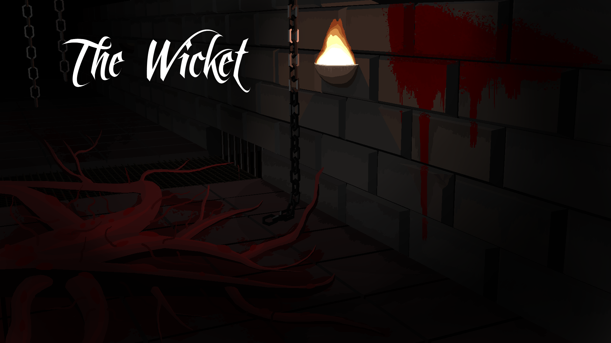
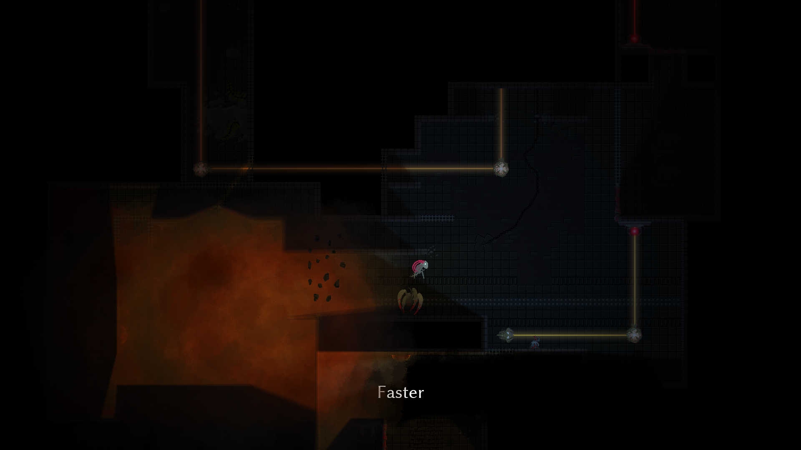
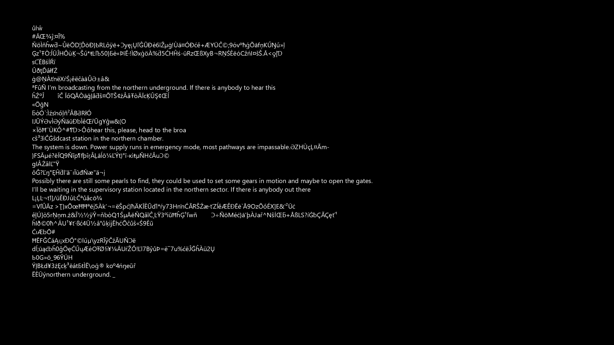
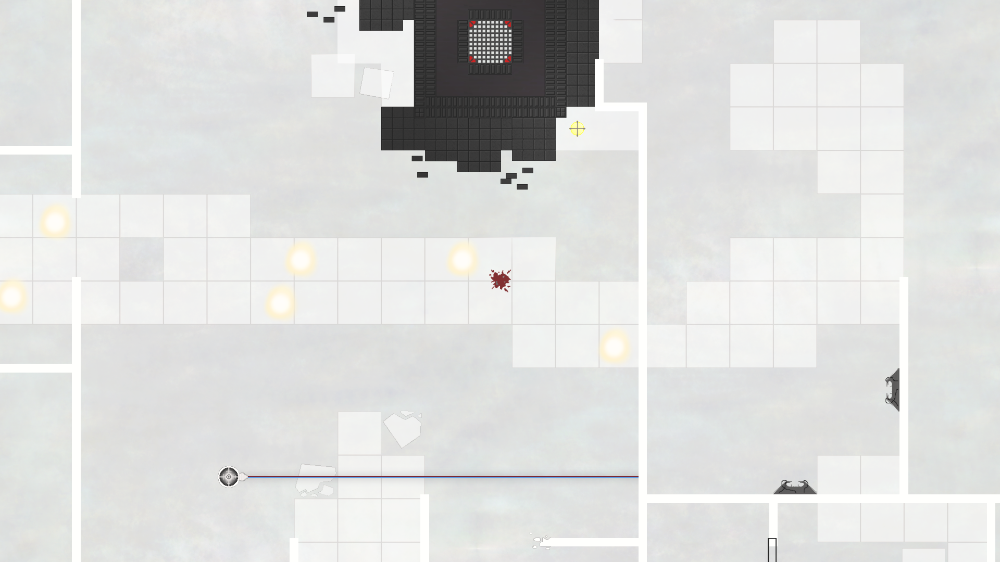
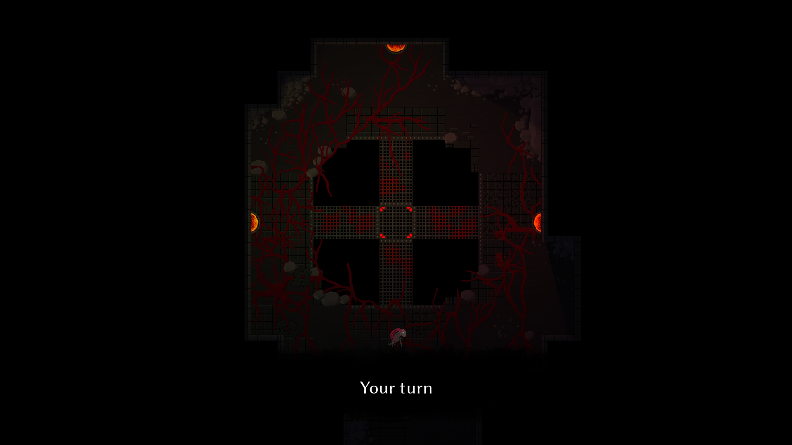
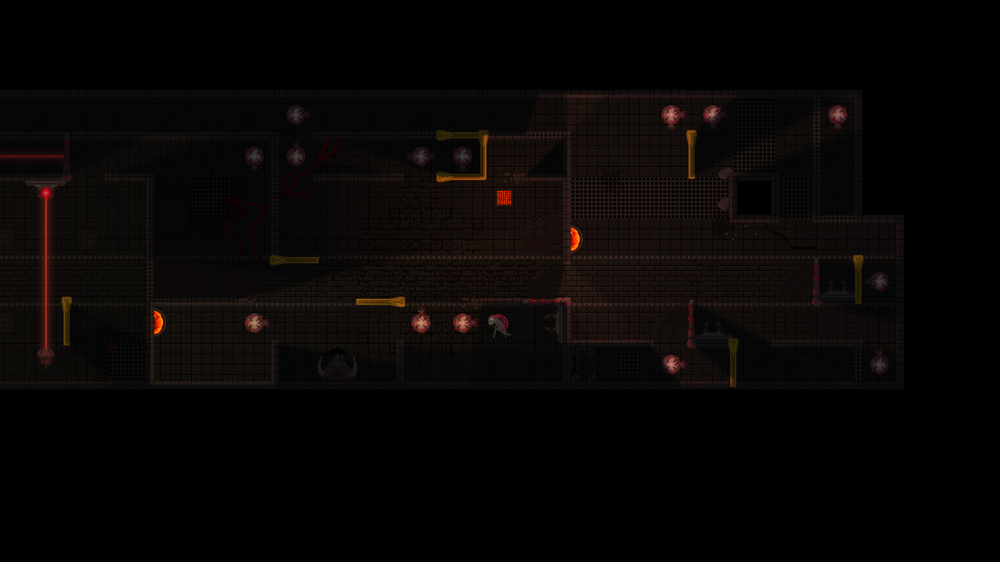
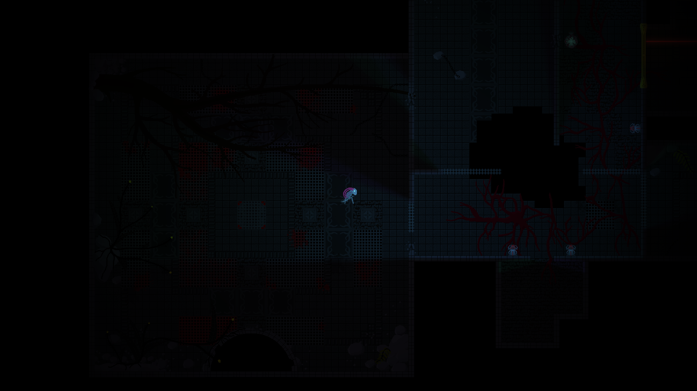
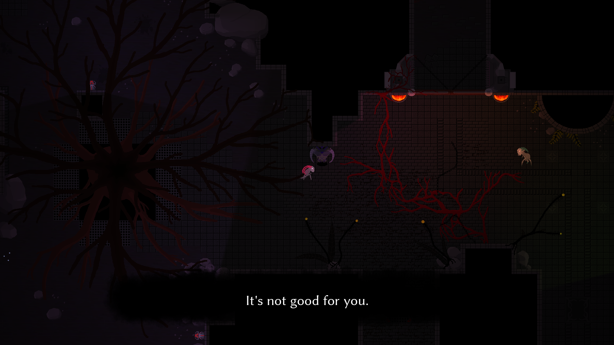
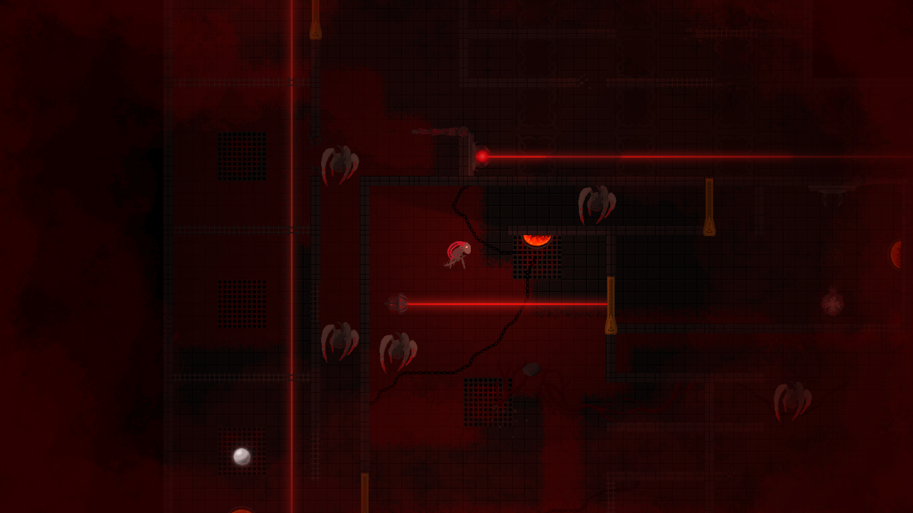
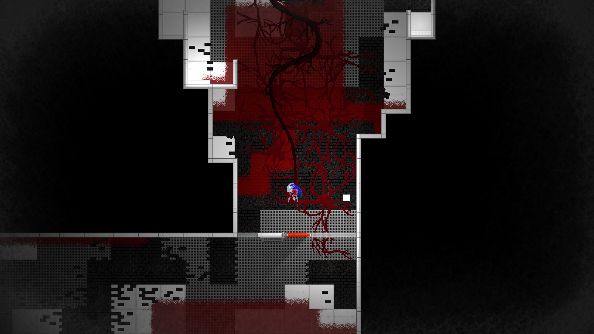

# About
The Wicket is a 2D puzzle-adventure game kept in dark, survival horror style. Gameplay involves levels based on classical maze with unconventional riddles, which require deep analysis and out-of-the-box thinking, as well as arcade elemets calling for precision and good timing. Mysterious setting in dying, abandoned world provides the backgorund for confusing, unsettling story supported by original soundtrack and quaint visuals.

The game is still in development, but first chapter "Subjection" is completed and open for beta-testing.

# Download
The Wicket: Chapter One can be dowloaded from Google Drive: 
[Download The Wicket: Chapter One](https://drive.google.com/open?id=0BxibG6wPBD5gfjZTUThZXzdTOEtvdHZPazRYek1SU2oybFJ1aXZYaVVPYTJBdC1WUFg2elk)
To launch the game, extract the archive and open The Wicket.exe file.

# Technical notes
The game is based on DirectX 11 engine and supports **only Windows systems**. All necessary libraries are included in archive. 

It needs up to 1 GB RAM and 1 GB VRAM to run properly.  "High shadow quality" available in the game is designed for efficient, dedicated memory cards only. Please choose right graphics processor if you consider using this option. 

# Gallery

